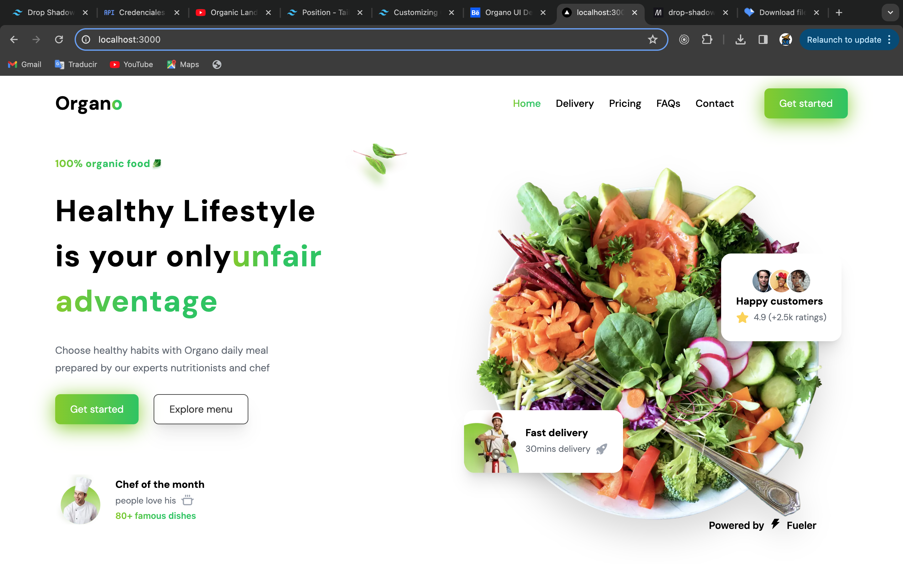

## 🧐 Healthy Landing

> This is a page made with HTML and Tailwind, we used a prebuild design on photoshop.

## 🔧 Built With

- HTML
- CSS
- Next
- React Icons

## 🔴 Live Demo

[Live Demo](https://healthy-landing-txl4.vercel.app/)

## 🛠 Getting Started

To get a local copy up and running follow these simple example steps.

- Go to the main page of te repo.
- Press the `Code` button and get the repo link.
- Clone it using git.

## ✒️ Authors

👤 **Unicorn Dad**

- [@UnicornDad8](https://github.com/UnicornDad8)

## 🤝 Contributing

Contributions, issues and feature requests are welcome!

Feel free to check the [issues page](issues/).

## 📝 License

This project is [MIT](lic.url) licensed.
